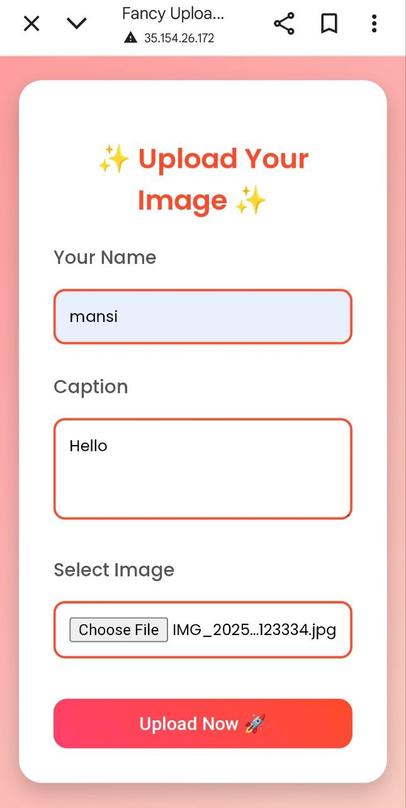

# Serverlessdia-Upload-Hub-AWS-Lambda-with-S3-and-DynamoDB-
 This project outlines a serverless media upload hub built using AWS Lambda, S3, and DynamoDB. It enables users to upload media files through a web interface, storing the files in S3 and their associated metadata in DynamoDB.

## Features

* **Serverless Backend:** Leverages AWS Lambda to provide scalable and efficient processing with zero server management

* **Reliable Object Storage:** Utilizes Amazon S3 for secure, durable, and highly available storage of media files.

* **Fast and Flexible Data Management:** Stores media metadata in Amazon DynamoDB, offering low-latency and scalable NoSQL database performance.

* **User-Friendly Upload Interface:** Includes a straightforward web form that enables users to easily upload media files.
  
  ## Project Architecture Diagram
  

## Project Walkthrough and Components

Below are the main components and features of the serverless media upload hub, demonstrated with screenshots to highlight each functionality:

## 1 Upload Interface

This image shows the web form used for uploading media, where users input a name, caption, and select a file.

## 2 IAM Role Permissions

Details of the IAM role permissions granted to the Lambda function, allowing it to interact with S3 and DynamoDB.

## 3 Lambda Function Code

A view of the Python code for the AWS Lambda function, which orchestrates the upload to S3 and data entry into DynamoDB.

## 4 S3 Bucket Overview

The Amazon S3 bucket (lamdawithdynadb) where the media files are stored.

## 5 DynamoDB Table Entries

 
 The reels DynamoDB table displaying the metadata for uploaded items, including id, caption, file_url, and name.

## Successful Upload Confirmation

The confirmation message displayed on the web interface after a successful media upload, showing the stored details and file URL.

## High-Level Deployment Steps
To set up this project:

* 1 Configure an S3 bucket for media storage.
Set up a DynamoDB table for metadata.
* 2 Create an IAM role with necessary permissions for Lambda, S3, and DynamoDB.
* 3 Develop and deploy the AWS Lambda function.
Optionally, create and attach a Lambda layer for dependencies.
* 4 Integrate with API Gateway to expose the Lambda function via HTTP.
* 5 Develop a simple frontend to interact with the API Gateway.

